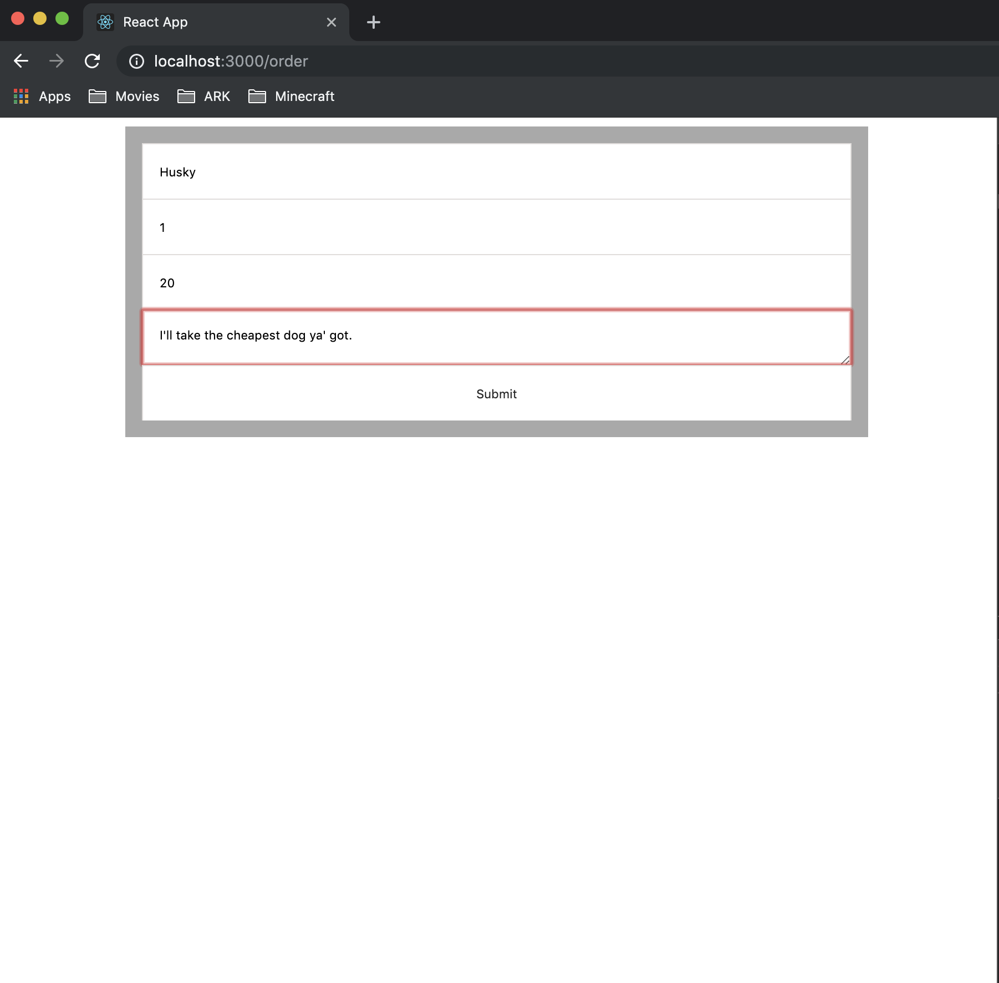

# Technology Assessment:

This project is for Teams 1,2,3,4, and 5. </br>
The project is basically a Cart Application where you can see all the cart items and add a new item to the cart.</br> 
The project is divided into backend and frontend. **You will only create the frontend using the technology you learned (React, or Angular, or Vue). You will only interact with the backend via Restful APIs.**</br> 


## Setup
You'll need to install the dependencies of both the backend and front-end by
using `npm install`.  After doing so, start up both the backend server and run
the app.

#### Backend
```shell script
cd cart-backend && npm install
node index.js
```
#### Front-end
```shell script
cd app && npm install
npm run start
```

You'll be able to find the webview at [localhost:3000](http://localhost:3000).


## Front-end Documentation
There are three pages:
1. [HomePage](http://localhost:3000)
   - 
2. [OrderForm](http://localhost:3000/order)
   - 
   - 
   - 
3. [CartPage](http://localhost:3000/cart)
   - 

The React app uses [Redux-Saga](https://redux-saga.js.org/) to manage global state
as a "source-of-truth".  As a result, ducks become super easy to write and you
never have to worry about components affecting state in weird ways.

I also used [Immutable.js](https://immutable-js.github.io/immutable-js/) because
storing references in the Redux state can still get you into trouble.

As a result, this app can easily be built-upon to build some really "reactive"
components all using shared state!

#### Closing Remarks
I did not spend too much time on design, as the project specs said not to.  Additionally,
I didn't write any unit tests -- since it was such a small project.  If you need
me to address these concerns, please let me know!

I **did** need to use the `cors` library
to allow `POST` requests from the client app... as there needed to be a more
lax cross-origin setting specified.

Let me know if you have any questions!

***
# Project Specifications
## Backend
You will download the backend app and run it.</br></br>
a. You can run the backend app using a program like "Visual studio code" by opening the folder and clicking the run button.</br></br>
b. OR You can run the backend app using the terminal:
1. cd /BackendAppFolder (The folder containing index.js file)
2. Write "node index.js" to run the javascript file (you will see a message saying "Listening on port 5555")

The APIs that you will call are:
1. GET /list : API returns the whole cart list in json format
(You can test this in a browser by going to the url http://localhost:5555/list
2. POST /item/add : API that receives a new cart item as a json request and adds it to the current cart list</br></br>
{</br>
	"name": "ABC", </br>
	"description": "ABCDEFGHIJKLMNOPQRSTUVWXYZ", </br>
	"price": 1, </br>
	"amount": 1 </br>
}</br></br>
**Kindly, note that all the fields are required to get a successful add request. Also, name should be of length greater than or equals to 3, description should be of length greater than or equals to 10,
and price and amount should be positive numbers.**

## Frontend
The frontend part is made up of 3 web pages.
1. **Home page** containing 2 buttons "Cart List" and "Add Item" and each button will navigate to a different page.
2. **Cart List page** will be navigated to when pressing the "Cart List" button. In this page you will send a GET /list request and show the data in a tabular format (not json).
3. **Add Item page** will be navigated to when pressing the "Add Item" button. In this page you will show 4 different input fields (name, description, price, amount) and an "Add" button. You will send a POST /item/add request and show that the request was successful.

**Kindly note that you don't have to show a good UI design, just basics**

## Github
You will get a github invitation to push your frontend app to, please don't change the backend code.

## Screenshots
Please take a series of screenshots for the frontend app as follows:
1. Screenshot of the Home page
2. Screenshot of the "Cart List page" showing the cart list
3. Screenshot of the "Add Item page" and make sure to show the data of the new item you are adding
4. Screenshot of the "Cart List page" showing the new updated cart list with the newly added item
